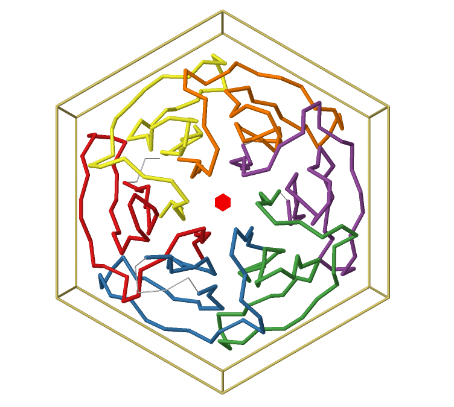
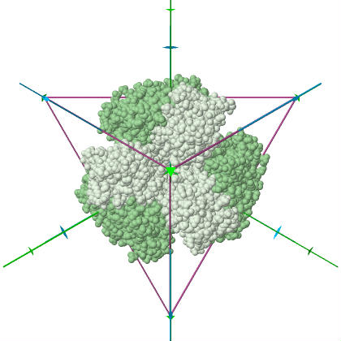

# Symmetry in Protein Structures

This project collects tools to detect, analyze, and visualize **protein symmetry**. This includes the CE-Symm tool for **internal symmetry**, a tool for **quaternary symmetry**, and other experiments relating to symmetry. 

This project serves dual purposes. First, it acts as an incubator for new methods and contains RCSB-specific or other non-production ready code. Stable methods have been moved to the [biojava](http://github.com/biojava/biojava) library, where they are accessible for programatic use. Second, user interfaces are built here following each BioJava release. See [releases](https://github.com/rcsb/symmetry/releases) for the latest CE-Symm executable.

## Tools

User interfaces are available within the [symmetry-tools](https://github.com/rcsb/symmetry/blob/master/symmetry-tools) module.

### CE-Symm

CE-Symm is a tool for detecting internal symmetry in protein structures.
CE-Symm version 2 is able to detect both open and closed symmetry and provide a multiple alignment of all repeats. 

See [CE-Symm documentation](symmetry-tools/docs/CeSymm.md) for more details on how to use the tool.

If you find CE-Symm useful for your research, please consider citing:

#### CE-Symm version 2:

**Analyzing the symmetrical arrangement of structural repeats in proteins with CE-Symm** 
*Spencer E Bliven, Aleix Lafita, Peter W Rose, Guido Capitani, Andreas Prlić, & Philip E Bourne*  
[PLOS Computational Biology (2019) 15 (4):e1006842.](https://journals.plos.org/ploscompbiol/article/citation?id=10.1371/journal.pcbi.1006842)  
 

#### CE-Symm version 1:

**Systematic detection of internal symmetry in proteins using CE-Symm** 
*Douglas Myers-Turnbull, Spencer E Bliven, Peter W Rose, Zaid K Aziz, Philippe Youkharibache, Philip E Bourne, & Andreas Prlić*  
[J Mol Biol (2013) 426 (11): 2255–2268.](https://doi.org/10.1016/j.jmb.2014.03.010)  
 

### QuatSymm

The QuatSymm tool is used for identifying quaternary symmetry in protein complexes.
It is also able to detect pseudosymmetry in complexes with structurally homologous subunits.
The QuatSymm tool is used by the RCSB Protein Data Bank's [quaternary symmetry analysis](http://www.rcsb.org/pdb/browse/stoichiometry.do) and it has also been utilized to assess protein assembly predictions at [CASP challenges](https://predictioncenter.org/).

See [QuatSymm documentation](symmetry-tools/docs/QuatSymm.md) for more details.

If you find the QuatSymm tool useful for your research, please consider citing the following publications where it has been described:

**BioJava 5: A community driven open-source bioinformatics library** 
*Aleix Lafita, Spencer Bliven, Andreas Prlić, Dmytro Guzenko, Peter W. Rose, Anthony Bradley, Paolo Pavan, Douglas Myers-Turnbull, Yana Valasatava, Michael Heuer, Matt Larson, Stephen K. Burley, Jose M. Duarte*  
[PLOS Computational Biology 15(2): e1006791](http://dx.plos.org/10.1371/journal.pcbi.1006791)  

## Dependencies

This project requires Java 1.8 or newer. Release versions of all tools can be run with no other dependencies.

To build from source, the library requires [Apache Maven](http://maven.apache.org/).

Additional dependencies ([BioJava](http://www.biojava.org), [Jmol](http://www.jmol.org), etc) should be automatically resolved by Maven.

## Building

To build, run

    mvn package
    
This will build the CE-Symm release packages (e.g. `symmetry-tools/target/cesymm-X.X.X.jar`) and jar files containing the other code.
