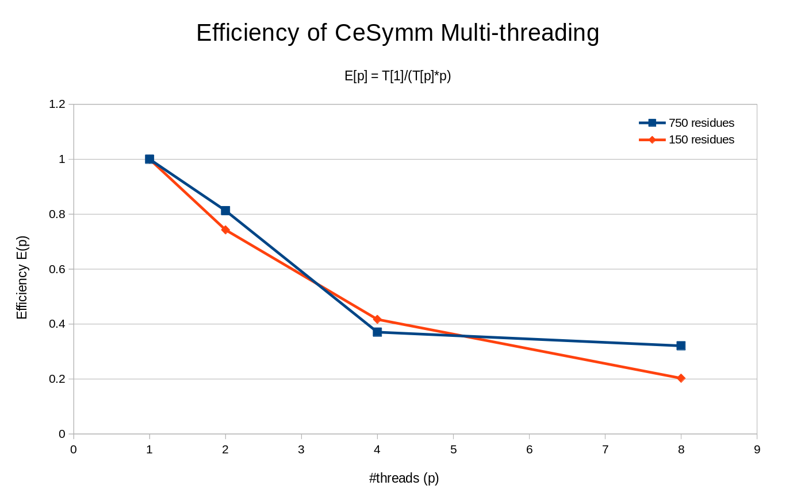

CE-Symm
=======

Usage
-----

The easiest way to run CE-Symm is via the included wrapper script.

```
usage:  runCESymm.sh [OPTIONS] [structures...]
```

CE-Symm can also run through java. The main class is <tt>demo.CeSymmMain</tt>, and it requires classpath entries for BioJava and the RCSB symmetry package.

```bash
java -Xmx500M -cp "jars/*" demo.CeSymmMain [OPTIONS] [structures...]
```

Options
-------

Options are specified in gnu style. Boolean options can be negated by prefixing with "no".
All common options have short forms.

Short Option | Long Option | Description
:----------: | :---------- | :----------
-h  | --help            | Print usage information
    | --version         | Print CE-Symm version
-i  | --input=file      | File listing whitespace-delimited query structures
-o  | --xml=file        | Output alignment as XML (use --xml=- for standard out)
    | --html=file       | Output alignment as HTML output
    | --ce=file         | Output alignment as CE output
    | --fatcat=file     | Output alignment as FATCAT output
    | --pdb=file        | Output each alignment as a two-model PDB file. The argument may be a directory or a formatting string, where "%s" will be replaced with the structure name. [default "%s.cesymm.pdb"]
    | --tsv=file        | Output alignment as tab-separated file
-o  | --stats=file      | Output tab-separated file giving alignment statistics, one line per structure [defaults to stdout, unless -q is given]
-q  | --nostats         | Do not output default statistics to standard out (equivalent to "--stats=/dev/null")
-v  | --verbose         | Print detailed output (equivalent to "--tsv=-")
-j  | --show3d          | Force jMol display for each structure [default for <10 structures when specified on command line]
-J  | --noshow3d        | Disable jMol display [default with --input or for >=10 structures]
-t  | --order           | Use TM-Score with order for deciding significance. [default]
-T  | --noorder         | Use TM-Score alone for deciding significance.
    | --ordermethod=Class   | Order detection method. Can be a full class name or a short class name from the org.biojava.nbio.structure.align.symmetry.internal package. [default SequenceFunctionOrderDetector]
    | --refinemethod=Class  | Refiner method. Can be a full class name or a short class name from the org.biojava.nbio.structure.align.symmetry.internal package. [default Single]
    | --symmtype=Class      | Symmetry Type. Can be a full class name or a short class name from the org.biojava.nbio.structure.align.symmetry.internal package. [default Auto]
    | --pdbfilepath=dir | Download directory for new structures [default temp folder]
    | --pdbdirsplit     | Indicates that --pdbfilepath is split into multiple subdirs, like the ftp site. [default]
    | --nopdbdirsplit   | Indicates that --pdbfilepath should be a single directory.
    | --threads=int     | Number of threads
    | --maxgapsize=float| This parameter configures the maximum gap size G, that is applied during the AFP extension. The larger the value, the longer the calculation time can become, Default value is 30. Set to 0 for no limit.
    | --scoringstrategy=str |   Which scoring function to use: CA_SCORING, SIDE_CHAIN_SCORING, SIDE_CHAIN_ANGLE_SCORING, CA_AND_SIDE_CHAIN_ANGLE_SCORING, or SEQUENCE_CONSERVATION
    | --winsize=int     | This configures the fragment size m of Aligned Fragment Pairs (AFPs).
    | --maxrmsd=float   | The maximum RMSD at which to stop alignment optimization. (default: unlimited=99)
    | --gapopen=float   | Gap opening penalty during alignment optimization [default: 5.0].
    | --gapextension=float  | Gap extension penalty during alignment optimization [default: 0.5].
    | --multaxes=bool   | Run iteratively the algorithm to find multiple symmetry levels [default: true].
    | --opt=bool        | Optimize the resulting symmetry alignment [default: true].
    | --threshold=float | The symmetry threshold. TM-scores above this value will be considered significant results [default: 0.5, interval [0.0,1.0]].
    | --maxorder=int    | The maximum number of symmetric subunits [default: 8].
    | --rndseed=int     | The random seed used in optimization, for reproducibility of the results [default: 0].
    | --minlen=int      | The minimum length, expressed in number of core aligned residues, of a symmetric subunit [default: 15].
    | --dcutoff=float   | The maximum distance, in A, allowed between any two aligned residue positions [default: 7.0].
    | --scopversion=version | Version of SCOP or SCOPe to use when resolving SCOP identifiers [defaults to latest SCOPe]

Interactive mode
----------------

By default, running CE-Symm will enter interactive mode. It will prompt you
for an input structure and display the result in a jMol window.

```bash
runCESymm.sh
```

You can also pass one or more structures to the program to bypass the input
dialog. A number of common ways to specify protein structures are supported,
including PDB IDs, SCOP domain identifiers, PDP domains, and filenames. See
BioJava's [StructureID.getStructure()](
http://www.biojava.org/docs/api/org/biojava3/structure/StructureIO.html#getStructure%28java.lang.String%29)
method for the complete syntax.

```bash
runCESymm.sh 1HIV
runCESymm.sh 1GEN.A d1tl2a_ PDP:1RI6Aa
```

Batch mode
----------

To run CE-Symm on many structures, specify input and output files. The input
should contain a list of whitespace separated structure identifiers. Lines
beginning with '#' are ignored. Note that using <tt>--input</tt> disables jMol
display by default. Use <tt>--jmol</tt> to override this behavior.

```bash
runCESymm.sh --input=queries.txt --xml=output.xml
```
An important feature in the batch mode is the multithreading implementation.
By *default*, all the allowed CPUs are used to run the symmetry analyses in 
parallel. The option `-threads N` can be used to set the number N of threads
to use. Note that the scaling efficiency of the multithreading is not perfect,
and the **thread overhead** will dominate with more than 8 threads. The scaling
factor for 8 threads is between 2.5 (for large structures) and 1.5 (for small
structures). See the efficiency plot below for graphical performance evaluation:



Output
------

By default, the program will output some basic statistics about each alignment
to standard out in a simple tab-delimited format. This is equivalent to specifying
<tt>--stats=-</tt>, and can be repressed with the <tt>-q</tt> option.

Additional information can be output in the following formats. Most formats
represent the symmetry as an alignment from the structure to itself.

* __CE__: A single file containing all alignments in CE's traditional output format,
  with a line containing only '//' to separate records.
* __FATCAT__: A single file containing all alignments in FATCAT's traditional output
   format, with a line containing only '//' to separate records.
* __TSV__: A list of aligned residues for each structure,  with a line containing 
  only '//' to separate records.
* __HTML__: A nicely colored display of the alignments.
* __XML__: All the alignments in a custom XML format
* __PDB__: A PDB file containing the input structure as one model, and a rotated
  input structure as another model.

***Statistics Output***

By default (without -q), the program outputs the following statistics about each
alignment performed to standard out as a tab-delimited list:

- __Name__ Name of the structure
- __Symm__ Either Y or N depending on whether CE-Symm determined the protein to be symmetric
- __MinOrder__ If this structure is symmetric, the minimum order of symmetry detected.
- __TMscore__ TM-Score of the aligned portions
- __ZScore__ CE Z-Score of the aligned portion relative to non-homologous alignments
- __CEScore__ Raw CE score
- __PValue__ P-value calculated from the z-score
- __RMSD__ RMSD of the alignment
- __Length__ Number of aligned residues
- __Coverage__ Percentage of residues included in the alignment
- __%ID__ Percent sequence identity between aligned portions
- __%Sim__ Percent sequence similarity between aligned portions
- __time__ Time required for the alignment itself (seconds)


License & Availability
----------------------

CE-Symm is licensed under LGPL 2.1 (see LICENSE, which should have come bundled
with the executable).

The source code is available at https://github.com/rcsb/symmetry-tools.
A webserver is also provided at http://source.rcsb.org/jfatcatserver/symmetry.jsp

If you use CE-Symm in your research, please cite:

Douglas Myers-Turnbull, Spencer E Bliven, Peter W Rose, Zaid K Aziz, Philippe
  Youkharibache, Philip E Bourne, and Andreas Prlic. Systematic detection of
  internal symmetry in proteins using CE-Symm. 2014. Awaiting publication.

Examples
--------

```
# Get help
runCESymm.sh -h

# Full interactive mode. Prompts for an input structure & runs CE-Symm,
# displaying the result using jMol
runCESymm.sh

# Run CE-Symm on a single structure or a short list of structures
# and display the results using jMol
runCESymm.sh 1HIV
runCESymm.sh 1GEN.A d1tl2a_ PDP:1RI6Aa
runCESymm.sh ./myprotein.pdb

# Print result summary to standard out, repressing jMol display
runCESymm.sh --noshow3d 1GEN.A 1TL2.A 1RI6.A

# Print detailed alignment information
runCESymm.sh -v 1GEN.A

# Output XML file with full alignments and detailed results
runCESymm.sh --xml=output.xml -J 1GEN.A 1TL2.A 1RI6.A

# Run in batch mode.
# The input file should list one structure per line.
# Accepts PDB IDs ("4hhb"), SCOP identifiers ("d4hhba_"), or ranges ("4hhb.A","4hhb.A_1-141")
# Lines beginning with '#' are ignored.
runCESymm.sh --input=queries.txt --xml=output.xml

# Alignments can be output as two-model PDB files.
# The --pdb option can take a directory
#runCESymm.sh --input=queries.txt --pdb=.
# It can also take a format string, where "%s" gets substituted for the structure name.
runCESymm.sh --input=queries.txt --pdb=%s.cesymm.pdb
```


--------------------
[Home](../README.md)
